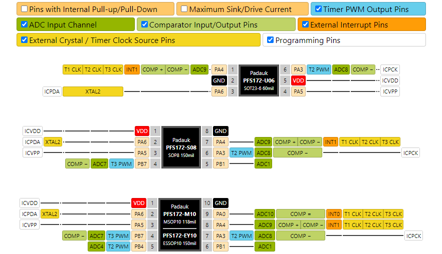

# Integrated Circuit Pinout Diagram Generator



This is a simple web tool to generate pin mappings for integrated circuits.
It is live at [cmfcmf.github.io/ic-pinout-diagram-generator](https://cmfcmf.github.io/ic-pinout-diagram-generator).
It is inspired by the work done by [@sleemanj](https://github.com/sleemanj/) on their
[ArduinoOrientedChipPinoutCreator](https://github.com/sleemanj/ArduinoOrientedChipPinoutCreator), but is a bit more flexible.

Currently, pin mappings for many [Padauk mikrocontrollers](http://www.padauk.com.tw) are available.
You can add your own pin mappings by editing `src/chips.ts` and the files in `src/chips`.

## SDK

You can embed these pinout diagrams on your own page. To do that, simply place the following code snippet into your HTML:

```html
<div id="pinout-diagram"></div>
<script src="https://unpkg.com/@cmfcmf/pinout-diagrams/dist/sdk.min.js"></script>
<script>
  PinoutDiagrams.render(document.getElementById("pinout-diagram"), {
    // Don't specify if you want to disply all ICs
    ics: [
      "name-of-the-first-ic-you-want-to-embed",
      "name-of-the-second-ic-you-want-to-embed",
    ],
    // maxWidth of the legend. Don't specify to use 100%
    maxWidth: "980px",
  });
</script>
```

### Nightly Builds

Use the following URL for nightly builds of the SDK: https://cdn.jsdelivr.net/gh/cmfcmf/ic-pinout-diagram-generator@nightly/sdk.min.js

## Development

To preview your changes, clone this repository, install Node.js 14 or later, run `npm install`, `npm run start`, and then open http://localhost:5000.

All code (except for code in `src/chips`) should be formatted using prettier by running `npm run format`.

In development, the bottom right of your screen will show a green "lag radar" that is used to visualize "lag" when rendering (e.g., when toggling different ic functions on and off).

**Please note that changes to the CSS files are not currently hot reloaded. You need to reload your browser manually after making changes to CSS.**

### Releasing a new version

```bash
npm version patch|minor|major
git push --follow-tags
gh release create --verify-tag --generate-notes
```

GitHub Actions will then take care of publishing to the npm registry.

## LICENSE

MIT
